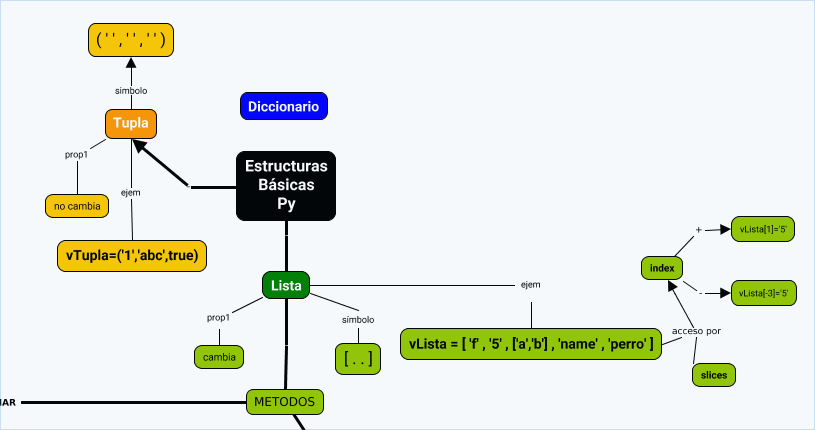

## 1.- Contenidos y Ponderaciones 
### 1.- Sintaxis.
```
#!/usr/bin/python3
import Coche
import utilitario
```
### 2.- Comentarios.
```
#Esto es un comentario
print("Hola Prog.1")
```
ó
```
print("Hola Prog.1") #Esto es otro comentario
```

### 3.- Datos.
En Python, el tipo de dato de las variables se asigna al declararla:
| Ejemplo                                          | Tipo de Dato |
| ------------------------------------------------ | ------------ |
| x = str("Hola teleprgm1")                        | str          |
| x = int(20)                                      | int          |
| x = float(20.5)                                  | float        |
| x = complex(1j)                                  | complejo     |
| vCiudades = \["Caracas", "Lima", "Bogota"\]      | list         |
| vFrutas = ("Pera", "Manzana", "Fresa")           | tuple        |
| vRango = range(6)                                | range        |
| vProfesores = {"nombre" : "Carlos", "edad" : 21} | dict         |
| vAprobado = True                                 | bool         |



### 4.- Identificadores.
Los identificadores son nombres usados con el fie de 'identificar' una variable, funcion, clase, modulo y otro objeto.  Empieza con la letra 'A'-'Z' o 'a'-'z' o un underscore '_'.
Python es un lenguaje 'case sensitive', es decir, 'vContador' no es lo mismo 'vcontador'.

**Identificadores Validos**
ab10c: Contiene letras y numeros
abc_DE: Todos los caracteres son validos
_: Asi solo, es valido. 
_abc: Puede empezar con un underscore.

**Identificadores Invalidos**
99: No pueden ser solo digitos.
9abc: No pueden iniciar con un digito.
x+y: No se permiten caracteres especiales
for: Es una palabra reservada

### 5.- Expresiones, Operadores, Operandos y su orden de evaluación.
#### 5.1 Operadores Aritméticos
| Operador 	| Nombre              	| Ejemplo 	|
|----------	|---------------------	|---------	|
| +        	| suma                	| x+y     	|
| -        	| resta               	| x-y     	|
| *        	| producto            	| x*y     	|
| /        	| division            	| x/y     	|
| %        	| módulo              	| x**y    	|
| **       	| exponenciación      	| x**y    	|
| //       	| división y redondeo 	| x//y    	|
#### 5.2 Operadores de asignación
| Operador | Ejemplo | Igual a    |
| -------- | ------- | ---------- |
| =        | x = 5   | x = 5      |
| +=       | x += 3  | x = x + 3  |
| -=       | x -= 3  | x = x - 3  |
| *=       | x *= 3  | x = x * 3  |
| /=       | x /= 3  | x = x / 3  |
| %=       | x %= 3  | x = x % 3  |
| //=      | x //= 3 | x = x // 3 |
| **=      | x **= 3 | x = x ** 3 |
| &=       | x &= 3  | x = x & 3  |
| \|=      | x \|= 3 | x = x \| 3 |
| ^=       | x ^= 3  | x = x ^ 3  |
| >>=      | x >>= 3 | x = x >> 3 |
| <<=      | x <<= 3 | x = x << 3 |
#### 5.3 Operadores de comparasión
| Operador | Nombre            | Ejemplo |
| -------- | ----------------- | ------- |
| ==       | Igual             | x== y   |
| !=       | Distinto          | x!= y   |
| >        | Mayor que         | x> y    |
| <        | Menor que         | x< y    |
| >=       | Mayor o igual que | x>= y   |
| <=       | Menor o igual que | x<= y   |
#### 5.3 Operadores Lógicos
| Operador | Descripción                                                      | Ejemplo               |
| -------- | ---------------------------------------------------------------- | --------------------- |
| and      | Retorna 'True' si las dos proposiciones son ciertas              | x < 4 and x > 1       |
| or       | Retorna 'True' si una de las dos proposiciones es cierta         | x > 5 or y < 4        |
| not      | Reversa el resultado, devuelve 'False' si el resultado es 'True' | not(x < 5 and x < 10) |
#### 5.4 Operadores de Identidad
| Operador | Descripción                                                 | Ejemplo    |
| -------- | ----------------------------------------------------------- | ---------- |
| is       | Devuelve 'True' si las dos variables son el mismo objeto    | x is y     |
| is not   | Devuelve 'True' si las dos variables no son el mismo objeto | x is not y |
#### 5.5 Operadors de Membresía
| Operador | Descripción                                                                   | Ejemplo    |
| -------- | ----------------------------------------------------------------------------- | ---------- |
| in       | Devuelve 'True' si una secuencia con un valor específico                      | x in y     |
| not in   | Devuelve 'True' si una secuencia con un valor específico no esta en el objeto | x not in y |

### 6.- Estructuras de flujo de control.
Vamos a definir los elementos que controlan el flujo de la ejecución de un programa.
Para controlar el flujo secuencial de un programa, tenemos, para emrezar dos instrucciones:
 - FOR (ejecuta código en un ciclo)
 - IF (determina la condicionalidad de una propuesta)


### 7.- Actividades propuestas 8 pts.
- Escribir un programa en python que calcule e imprima en pantalla la superficie de un triángulo en función de la base y la altura (S = 1/2 Base × Altura). Los valores son introducidos por el usr.

- Calcular y visualizar la longitud de la circunferencia y el área de un círculo de radio dado.